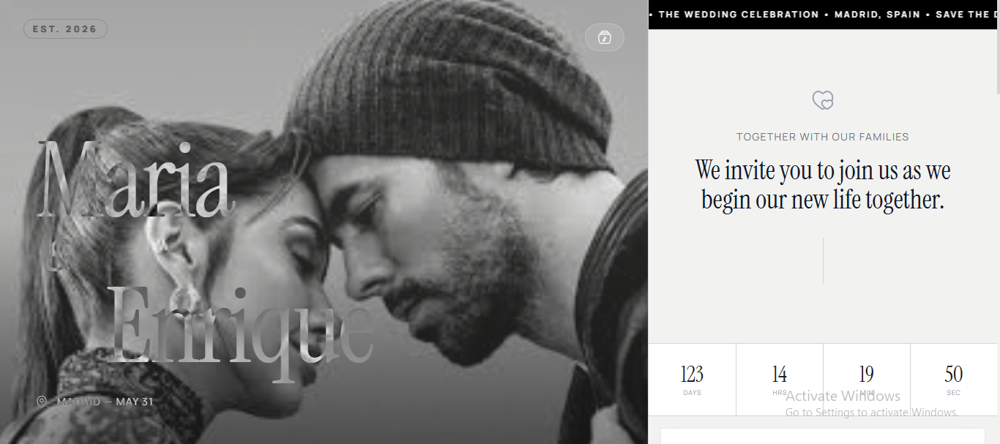

# 💍 Wedding Invitation Website — Front-End Project

A modern, elegant, and fully responsive wedding invitation website designed to deliver a premium digital experience.

This project blends visual storytelling with smooth animations, interactive music, and a clean, modern UI/UX layout.

---

## ✨ Key Features

- Fully responsive design (Mobile, Tablet, Desktop)
- Smooth animations & transitions
- Elegant wedding theme UI
- Interactive background music player
- Countdown timer to event date
- Optimized performance

---

## 🛠 Tech Stack

- HTML5  
- CSS3  
- JavaScript  

---

## 🚀 Live Demo

_(Deployment in progress — link will be updated soon)_

---

## ⚙️ How to Run Locally

1. Clone the repository  

```bash
git clone https://github.com/asadmirza-34/wedding-invitation-website.git

2. Open the project folder

3. Run `index.html` in your browser  
_(No server required)_

---


## 📂 Project Structure

wedding-invitation-website/
│
├── assets/
│   └── preview.png
├── images/
├── music/
├── index.html
├── style.css
├── main.js


---


👤 Author

Asad Mirza
Software Engineering Student | Beginner Web Developer

🔗 LinkedIn: https://www.linkedin.com/in/asad-mirza-8554a134b/

🔗 GitHub: https://github.com/asadmirza-34


📜 License

This project is created for learning and portfolio purposes.
If reused or modified, proper credit to the author is appreciated.

